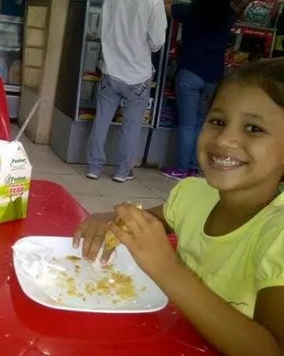

<html lang="es">
<head>
    <meta charset="UTF-8">
    <meta name="viewport" content="width=device-width, initial-scale=1.0, maximum-scale=1.0, user-scalable=no">
    <title>¡Feliz Cumpleaños! ❤️</title>
    

    
</head>
<body>

    <audio id="musicaFundo" loop preload="auto">
        <source src="exploration.mp3" type="audio/mpeg">
    </audio>

    <!-- TELA DE BLOQUEIO -->
    

        <h2 style="color: #facc15; font-size: 1.3rem; margin-bottom: 5px;">La Puerta Secreta 🗝️</h2>
        
Ingresa la clave para abrir el portal...

        

            

                

                

                    

                    

                    

                

            

        

        

            
💡 Pista: Es la contraseña de mi celular 📱🗝️

            <input type="password" id="passInput" class="password-input" maxlength="4" placeholder="••••" pattern="[0-9]*" inputmode="numeric">
            <button class="btn-unlock" onclick="verificarSenha()">Desbloquear 🗝️</button>
            ¿Olvidaste la clave? 🗝️
            

        

    

    <canvas id="bg-canvas"></canvas>

    

        <header>
            <h1>¡Feliz Cumpleaños! ❤️</h1>
            

                
            

        </header>

        <!-- CARTÃO PRINCIPAL -->
        <section class="card">
            
Hola. ❤️

            
Conocerte ha sido una de las mejores cosas que me han pasado en la vida. Nunca voy a olvidar la primera vez que te vi y cómo desde entonces nos fuimos acercando poco a poco.

            
Hoy, en tu cumpleaños, quiero que sepas lo especial que eres para mí. Gracias por tu cariño, por tu compañía y por estar siempre ahí.

            
Espero que este nuevo año de vida esté lleno de alegría, salud, sueños cumplidos y muchos momentos bonitos.

            
Siempre estaré a tu lado para apoyarte, cuidarte y valorar la hermosa amistad y conexión que tenemos.

            
Espero que te guste este pequeño detalle. Lo hice con todo mi cariño para ti.

            
También espero que te guste este pequeño ramo de girasoles. 🌻 Sé cuánto te gustan y quise regalártelos como un símbolo de la luz que traes a mi vida.

            
Y, por cierto... ¿Recuerdas la primera vez que te invité a salir y me dijiste "en mi próximo cumpleaños"? Bueno... ese "próximo cumpleaños" por fin llegó. ❤️ Espero que disfrutes mucho este día y espero que aceptes mi invitación. Si es un sí, tienes el botón "SÍ" aquí abajo (o el "NO", si te atreves a intentarlo).

            

                
¿Aceptas abrir la pequeña puerta conmigo hoy? 🗝️✨

                

                    <button class="btn-action btn-sim" onclick="respostaSim()">¡SÍ! ❤️</button>
                    <button class="btn-action btn-nao" id="btnNao" onclick="desviar()" onmouseover="desviar()" ontouchstart="desviar(event)">NO</button>
                

            

        </section>

        <!-- FOTO DE INFÂNCIA NO SEU PRÓPRIO QUADRO -->
        <section class="photo-card">
            

                
            

            
¿Quién diría que esta niña tan pequeña se convertiría en esta mujer tan increíble? Creo que tuve mucha suerte de conocerte y espero de corazón que esta amistad nunca se acabe. ✨

        </section>

        <!-- BOTÃO DE VÍDEO -->
        <section class="video-section">
            <a href="https://www.instagram.com/reel/DbOpWbKi3Ri/?igsh=MXhlOG81eGs0aWlyMw==" target="_blank" rel="noopener noreferrer" class="btn-video">
                🎥 Mira este video ❤️
            </a>
        </section>

        <!-- SPOTIFY -->
        <section class="spotify-section">
            

                <iframe src="https://open.spotify.com/embed/playlist/2u7hAgL7NegOZq3F2k0Ehm?utm_source=generator&theme=0" allowfullscreen="" allow="autoplay; clipboard-write; encrypted-media; fullscreen; picture-in-picture" loading="lazy"></iframe>
            

        </section>
    

    <footer>
        
A través de la pequeña puerta y más allá de las estrellas... 🗝️ 🧵 ❤️

    </footer>

    
</body>
</html>

